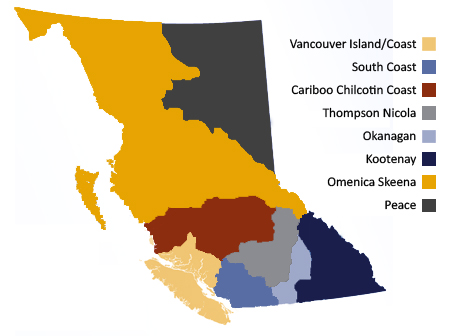

Optimal Water Allocation for Agricultural Production in British Columbia
================
Philip Loewen
2023-04-15

- <a href="#introduction" id="toc-introduction">Introduction</a>
- <a href="#agricultural-snapshot-of-bc"
  id="toc-agricultural-snapshot-of-bc">Agricultural Snapshot of BC</a>
- <a href="#methodology" id="toc-methodology">Methodology</a>
- <a href="#findings-and-discussion"
  id="toc-findings-and-discussion">Findings and discussion</a>
- <a href="#conclusion" id="toc-conclusion">Conclusion</a>
- <a href="#refs" id="toc-refs">References</a>

# Introduction

With climate change, the problem of water allocation has become more and
more important. Every year, summers in British Columbia become harsher
with extreme heat and droughts. It is then of utmost importance to
properly allocate the water that is available to us in the most
efficient way possible, especially in agriculture, which without proper
allocation will lead to unsuccessful harvest seasons and unhealthy
livestock. The goal of this report will be to determine optimal
allocation of water to different farm types using linear programming
during the month of August, with the goal to maximize the overall
revenue of the agricultural industry, with the limited quantity of water
available.

<table>

<tr><td>

|Type Of Animal| Gallons Per Day|
|---|---|
|***Beef***| |
|Cow with calf| 12|
|Draw cow/Mature Cow| 10|
|Calf| 3|
|Feeder - growing| 6-9|
|Feeder - finishing| 9-12|
|Bull | 12|
|***Dairy***| |
|Milking| 36|
|Dry cow/Replacement| 12|
|Calf| 3.5|
|Sheep and Goats | |
|Ewe/Doe| 2.5|
|Milking Ewe/Doe| 3.5|
|Feeder Lamb/Kid| 2|
|***Bison, Horse, Mule***| 12|

</td><td>

|Type Of Animal| Gallons Per Day|
|---|---|
|***Swine***| |
|Farrow - finish| 24/sow|
|Farrow - late wean| 8/sow|
|Farrow - early wean| 6.5/sow|
|Feeder | 2/pig |
|Weaner | 0.6/pig|
|***Poultry (per 100)***| |
|Broiler| 4.2 |
|Roaster/Pullet| 4.8|
|Layer| 6.5|
|Breeder| 8.5|
|Turkey-grower|15.5|
|Turkey - heavy| 19|
|***Ostritch***| 1.2|
|***Deer, LLama, Alpaca***| 2.5|
|***Elk, Donkey***|6|

</td></tr>
</table>

Estimated average daily water consumption for livestock (source: Ministry of Agriculture and Lands BC, 2006)

  

Using data from previous years (Statistics Canada, 2012), the province
of British Columbia uses 60 million $m^3$ of water in the months of July
and August. Converting this to gallons gives 15.85 billion gallons.

British Columbia is very agriculturally diverse, with many cattle,
poultry as well as fruit and tree farms. The number of farms of each
type is as follows:

|Farm Types |	Number of farms |
|---|---|
|Total number of farms |	15,841 |
|Oilseed and grain farming	| 419 |
|Vegetable and melon farming	| 1,077 |
|Fruit and tree nut farming	| 3,036 |
|Greenhouse, nursery and floriculture production	| 1,167 |
|Other crop farming	| 3,021 |
|Cattle ranching and farming	| 2,776 |
|Hog and pig farming	| 93 |
|Poultry and egg production	| 1,266 |
|Sheep and goat farming | 636 |
|Other animal production	| 2,350 |

(Statistics Canada, 2021b)

  

Each farm type will require a different amount of water. On top of this,
the quantity of water required in each type will also differ, as larger
farms will need more water. Using linear programming we can optimize the
allocation of water. To do so, we can set an objective function that
aims to minimize water usage, while reaching a certain yield level. To
do so we will consider the different crop and livestock types, the water
requirements for each farm type and the farm size.

The data we will use for crop and livestock water requirements is from
the Agriculture Water Demand Model for different regions in BC (Ministry
of Agriculture and Lands BC, 2023). As our data for farm types is
aggregated by larger groups, but our data for water requirements is more
individual, and it is separated by regions in the province, we will have
to make calculations to generalize the requirements by group by using
weighted averages.

As livestock farms are more sensitive to bad seasons than other
agricultural farms, since death or illness of livestock can set back a
farmer for several years ahead, we will allocate full water requirements
to animal farms. Using a livestock watering fact sheet (Ministry of
Agriculture and Lands BC, 2006), and data from the census of agriculture
(Statistics Canada, 2021a), we can determine livestock in BC requires
394,373,550 gallons of water in one month. Subtracting this from the
15.85 billion gallons total leaves 15.45 billion gallons for plant
farms.

Of these remain farms, we have oilseed and grain, vegetable and melon,
fruit and tree nut, greenhouse, nursery and floriculture and finally
“other crop” farms.
  

# Agricultural Snapshot of BC

Agricultural Regions of BC (source: Government of BC)

  

With a surface of 944 735 $m^2$, British Columbia is the second biggest
province in Canada, and the fourth biggest province or territory in the
country, behind Nunavut, Quebec and the Northwest Territories. Due to
its immense size, the agricultural landscape is very diverse, with many
different plants being grown, and livestock being raised. The province’s
most common livestock are dairy cows, cattle and poultry, and its most
commonly produced plant products fruits, vegetables, flows, shrubs and
mushrooms.

The Oakanagan-Thompson, which is BC’s second largest agricultural
region, is known for producing fruit and wine. The Lower Mainland and
especially the Fraser Valley is BC’s largest producer of livestock, eggs
and dairy, while earning the top gross farm receipts (The British
Columbia Agriculture in the Classroom Foundation, 2014). Indeed while
driving on highway 1 eastbound, it is not uncommon to see, or smell
these livestock farms along the road.
  

# Methodology

To calculate the optimal quantities of water for each farm type, much
cleaning of the data and reformatting had to be done.

The data from the farm census set farms into groups of farm sizes of 1
acre, 2-10 acres and 11+ acres. This posed a problem as we do not have
accurate data on the size of farms and must resort to approximations. As
such I used sizes of 1, 5 and 11 to represent these groups. Then, by
aggregating the farms by farm type, a total area for each type was
estimated. Similarly, the revenue of the farms were in groups of under
\$2500, \$2,500 to 4,999, \$5,000 to 9,999, \$10,000 to 24,999, \$25,000
to 49,999, \$50,000 to 99,999, \$100,000 to 249,999, \$250,000 to
499,999 and \$500,000 and over. I elected to use the upper bound of
these groups, and \$750,000 as the value for the last group. Then, using
data for the average farm revenue and expense by farm type, I was able
to use the expense to revenue ratio to calculate a lower bound for the
revenue of farm type. These ratios were typically around 85% of revenue
being the cutoff. These lower bounds for revenue represent a value that
we should ensure each farm attains on average, as achieving revenue
lower than this bound would be a net loss for the farm.

For the water requirements, the BC Agriculture Water Demand Model
provided estimates for the demand of plant types in different regions of
the province. With most area of BC farms being in the Peace River,
Thompson-Oakanagan and Cariboo regions, the water requirement estimates
for these regions were prioritized over the other regions. These
estimates were given in mm and, using these figures, and multiplying
them by the area of the farms, we are able to calculate an estimate for
how much volume of water each plant type requires.

By assuming that crop returns are linearly related to the amount of
water given to them, a linear decrease in water received will lead to a
linear decrease in output produced which in turn will lead to a linear
decrease in revenue. Hence a lower boundary for the amount of water each
farm type receives was created, based on the same revenue/expense ratios
found previously.

A linear programming problem was then set in the following manner: -The
objective function was to maximize revenue, using the formula:

$$z = \sum \frac{{H2O}}{H2O_{Optimal}}*{Revenue_{Optimal}}$$

- The constraints were that the total quantity of water must be smaller
  or equal to 15.45 billion gallons. Furthermore, each farm had to
  receive a minimum amount of water based on the revenue to expense
  ratio calculated previously, and the constant returns assumption.

Using the PuLP package in python we can easily set up this linear
programming problem and find the optimal value. First three dictionaries
were created: The minimum required water dictionary, which gave the
minimum amount of water each farm type required to operate and was used
for our constraints, then the farm revenue dictionary, which gives the
the revenue each farm type receives in receipts under normal conditions
and finally the regular water requirements for each farm type. The last
two of these dictionaries were used for our objective function.
  

# Findings and discussion

When computing the optimal value with PuLP, we can summarise the
findings in the following table:

| Farm Type | Quantity of Water (gallons) |
|---|---|
|Floriculture production | 39,852,800.0 |
|Fruit and tree nut farming | 165,669,000.0 |
|Mushroom production | 14,416,500,000.0 |
|Nursery and tree production | 204,991,000.0 |
|Oilseed and grain farming | 64,426,200.0 |
|Other crop farming | 295,189,000.0 |
|Other food crops grown under cover | 1,203,1800.0 |
|Vegetable and melon farming | 257,242,000.0 |

  

Using these quantities, an optimal revenue of 19,336,281,594.289265 \$
was calculated.

Clearly there are some limitations to this analysis. Firstly, this is
not accounting for how water will be distributed among the groups
themselves. Indeed further linear programming problems can be set to
find the “optimal” quantity of water each farm should receive, but this
analysis would be ever more complicated as we do not have much
information for individual farms.

Secondly, using estimates for gross receipt value, farm area and water
requirements was a feasible solution for the categories as a whole as
the true values should average out around the estimates but when
considering the farms individually, we should be more careful for these
values. Similarly, when considering the individual farms, we should
account for the soil type, the weather, how much the soil has been used,
what irrigation systems are used etc.

Fiinally, this allocation of water is made in away to help the economy
as a whole, and not individual farms. We can notice this as there is a
very uneven distribution as mushroom farms will receive 14.4 billion
gallons, whereas floriculture production farms will only receive 39.8
million gallons. Allocating water at such a macroscoping controlling
level would require great control over the available water from the
government to have the precise allocation calculated. This is not very
feasible in an economy like BC’s where farmers usually embrace more
freedom of operation rather than less.
  

# Conclusion

Despite the limitations of this analysis, I believe a model such as the
one I constructed could be very valuable for the economy of British
Columbia when encountering dry warm summers. To improve the model I
would include more accurate data about farm sizes, revenues and water
requirements, as wekk as a use a more complex objective function to
model how the change in quantity of water received by the plants relates
to the output of the farm. Furthermore I would consider farms at an
individual scale to assess each farm’s needs and allocate water more
efficiently to each and every one of them.

  
  

# References

Ministry of Agriculture and Lands BC. (2006). *Livestock watering
requirements - quantity and quality*.
<https://www2.gov.bc.ca/assets/gov/farming-natural-resources-and-industry/agriculture-and-seafood/agricultural-land-and-environment/water/livestock-watering/590301-1_livestock_water_requirements.pdf>

Ministry of Agriculture and Lands BC. (2023). *Agriculture water demand
model*. Cited on 2023-04-14.
<https://www2.gov.bc.ca/gov/content/industry/agriculture-seafood/agricultural-land-and-environment/water/water-management/agriculture-water-demand-model>

Statistics Canada. (2012). *Agricultural water use in canada*.
<https://www150.statcan.gc.ca/n1/en/pub/16-402-x/16-402-x2013001-eng.pdf?st=7lvnOWaT>

Statistics Canada. (2021a). *Census of agriculture b.c. Agriculture and
seafood statistics publications*.
<https://www2.gov.bc.ca/gov/content/industry/agriculture-seafood/statistics/agriculture-and-seafood-statistics-publications>

Statistics Canada. (2021b). *Table 32-10-0231-01 farms classified by
farm type, census of agriculture, 2021*. Cited on 2023-04-14.
<https://www150.statcan.gc.ca/t1/tbl1/en/tv.action?pid=3210023101>

The British Columbia Agriculture in the Classroom Foundation. (2014).
*Grow BC, a guide to BC’s agriculture resources*.
<https://www.bcaitc.ca/sites/default/files/Grow%20BC/GrowBC_2014_Intro.pdf>

